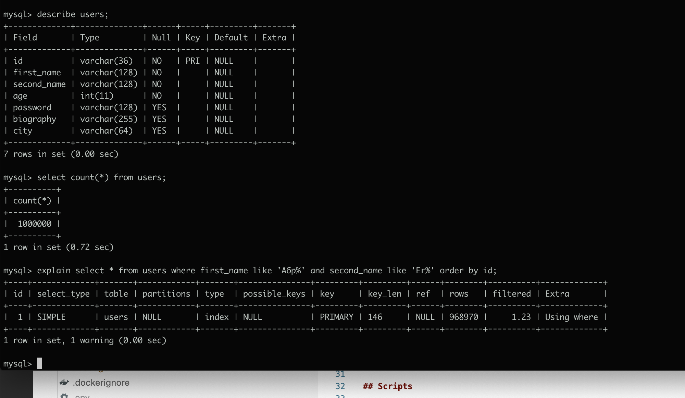
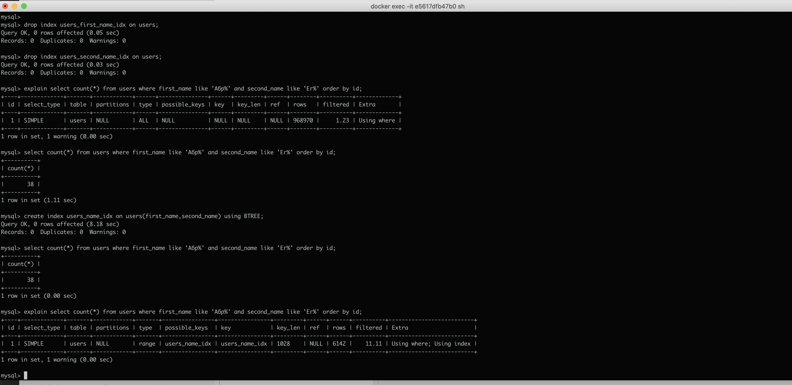
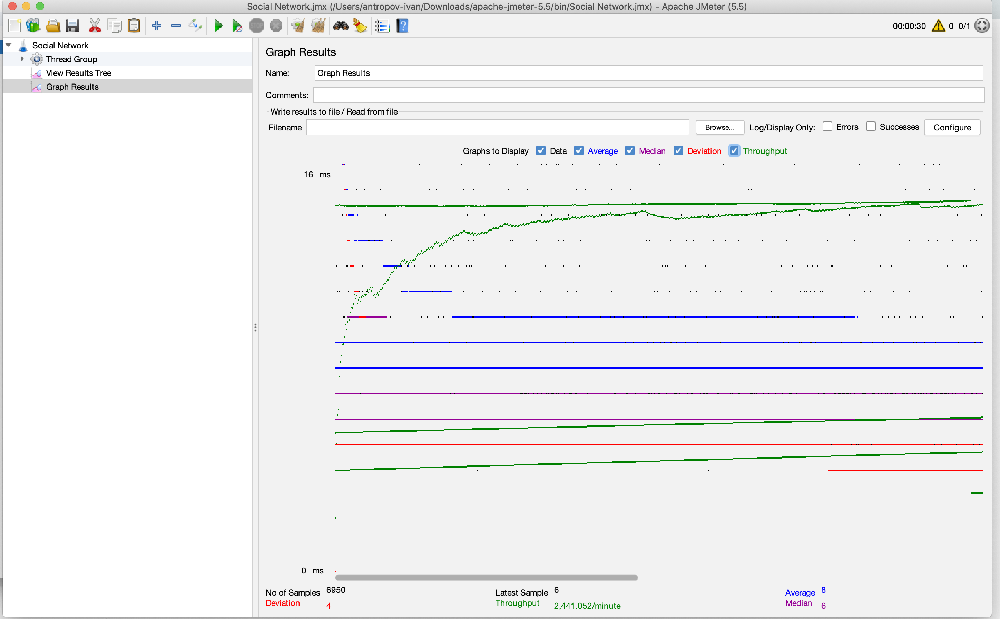
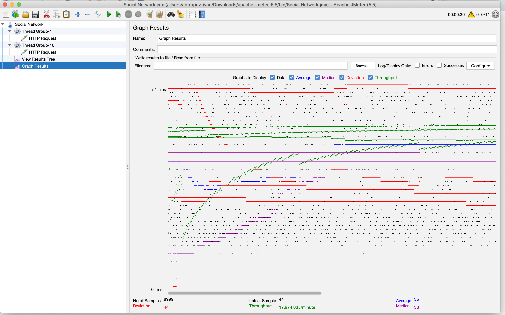
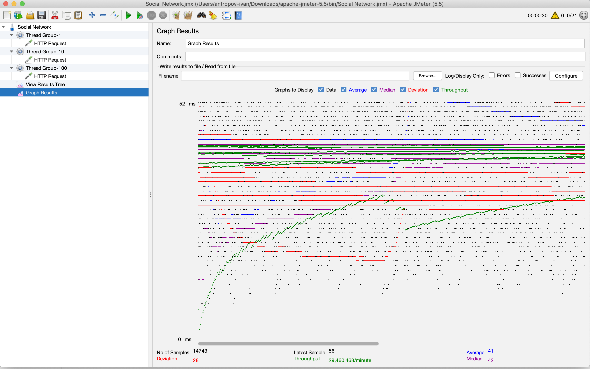
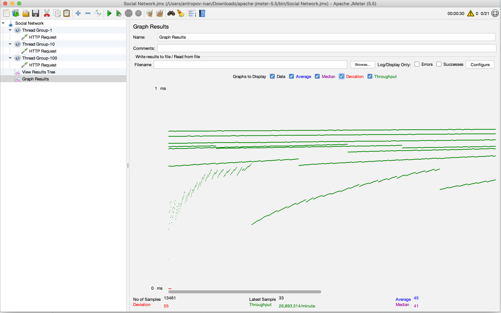
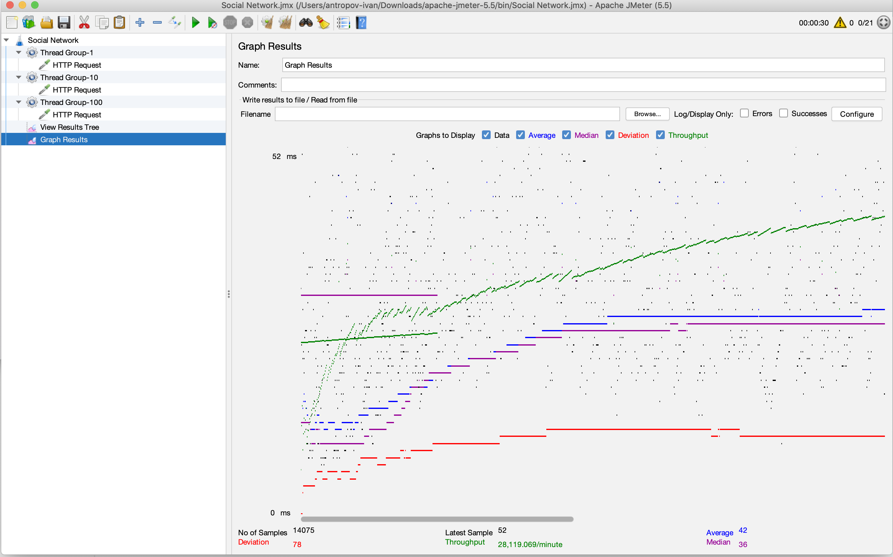
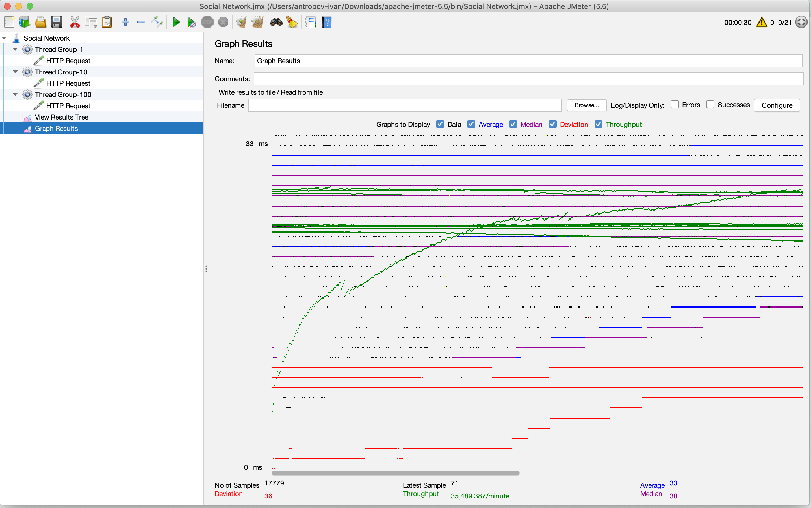

# Работа с индексами

В рамках данного задания я работал с таблицей users, в которой было 1_000_000 записей

## Вывод EXPLAIN

### До добавления индексов

### После добавления индексов

## Графики latency/throughput

### До добавления индексов (1)

### До добавления индексов (10)

### До добавления индексов (100)

### После добавления индексов (1)

### После добавления индексов (10)

### После добавления индексов (100)

