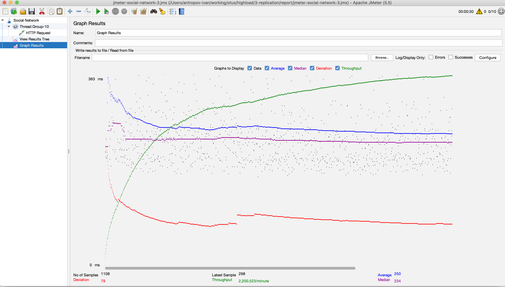

# ДЗ 3. Репликация

## Асинхронная репликация

### Описание

- Собираю кластер (конфиги мастера и реплик лежат рядом):
  - otus-vm-1 - master
  - otus-vm-2 - replica (async)
  - otus-social-network-3 - serverless container with the service otus
- Даю нагрузку на чтение через JMeter (конфиг лежит рядом)
- Замеряю в мониторинге показатели мастера/реплики/приложения/нагружаторе до и после начала репликации

Дополнительная информация (использованные ресурсы, команды, roadmap работ) в README.md в директории выше.

### Нагрузка на мастер (до/после начала репликации)

### Нагрузка на реплику (до/после начала репликации)

### Нагрузка на сервис (до/после начала репликации)

### Отчёт в jmeter(после начала репликации)

## Полусинхронная репликация

- Собираю кластер (конфиги мастера и реплик лежат рядом):
  - otus-vm-1 - master
  - otus-vm-2 - replica (semi-sync + GTID)
  - otus-vm-3 - replica (semi-sync + GTID)
  - otus-social-network-3 - serverless container with the service otus
- Настриваем semi-sync + GTID на мастере и репликах
- Даю нагрузку на запись через JMeter (конфиг лежит рядом)
- Вырубаю мастер (прибиваю контейнер)
- Промоучу 1ю реплику до мастера (обновляю конфиг и меняю REPLICATION SOURCE на второй реплике)
- 2 варианта догона транзакциями
  - Быстрый с потерями - просто обновляю GTID_PURGED / GTID_EXECUTED на реплике
  - Долгий без потерь - накатываю дамп с нового мастера

Дополнительная информация (использованные ресурсы, команды, roadmap работ) в README.md в директории выше.
