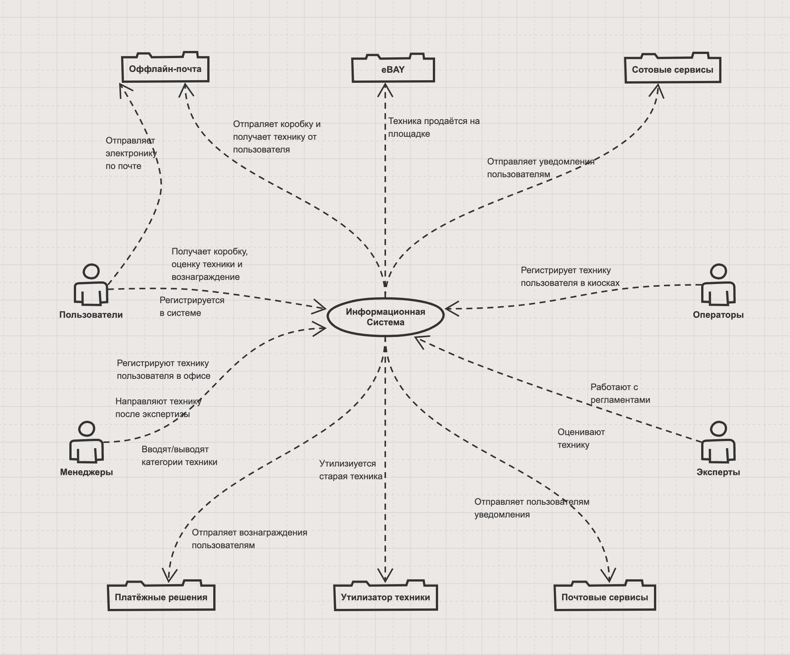

The remain plan:
- Сверить по презам:
  - Бизнес цель
  - Бизнес драйверы
  - Базовые характеристики
  - Критичные характеристики
- Дописать архитектурные альтернативы

# Architectural Kata

## Описание

https://nealford.com/katas/kata?id=GoingGreen

**Going Green**

A large electronics store wants to get into the electronics recycling business and needs a new system to support it. Customers can send in their small personal electronic equipment (or use local kiosks at the mall) and possibly get money for their used equipment if it is in working condition.

**Users**:

Hundreds, hopefully thousands to millions

**Requirements**:

- Customers can get a quote for used personal electronic equipment (phones, cameras, etc.) either through the web or a kiosk at a mall.
- Customers will receive a box in the mail, send in their electronic, and if it is in good working order receive a check.
- Once the equipment is received, it is assessed (inspected) to determine if it can be either recycled (destroyed safely) or sold (eBay, etc.).
- The company anticipates adding 5-10 new types of electronic that they will accept each month.
- Each type of electronic has its own set of rules for quoting and assessment.

**Additional Context**:

  - This is a highly competitive business and is a new line of business for us
  - If we haven’t received a type of electronic equipment in a year we will remove it from our system
  - We need to maintain a list of electronic equipment we are willing to accept as it changes often
  - Each piece of equipment has it’s own assessment (inspection) rules
  - We have the right to change the original quote to the customer if the product isn’t in the condition they said it was

## Решение

### Бизнес-цель

Реализовать информационную систему, которая позволить принимать старую электронику от пользователей и утилизировать/перепродавать ёё с прибылью

### Бизнес-драйверы

1. Зайти в новую для нас область и занять долю рынка
2. Получить прибыльный бизнес
3. Озеленить планету

### Стейкхолдеры

1. **Пользователи** - сдают электронику и получают вознаграждение
2. **Эксперты** - проверяют электронику и дают заключение (продать или сдать в переработку)
3. **Менеджеры** - принимают заказы от Пользователей в офисе, направляют технику после заключения от Экспертов, отправляет вознаграждения Пользователям
4. **Оператор** - принимает заказы от Пользователей в киоске

### Базовые сценарии

Далее **ИС** - это наша реализуемая информационная система

Далее **КП** - это клиентское мобильное приложение или клиентский раздел сайта системы

**UC1: Регистрация Пользователя**
1. Пользователь открывает КП
2. Пользователь регистрирует в ИС свой почтовый адрес и платёжные реквизиты

**UC2: Пользователь отправляет технику по почте**
1. Пользователь находит у себя ненужную технику
2. Пользователь отправляет запрос на приём техники через КП и получает предварительную оценку
3. Менеджер заводит для каждого экземпляра техники тикет в ИС
4. Менеджер отправляет Пользователю коробку для техники
5. Пользователь отправляет коробку с техникой Менеджеру
6. Менеджер отмечает получение техники в ИС и передаёт технику Эксперту
7. Эксперт делает заключение (на основании регламентов из ИС), отмечает результат в тикете и отдаёт технику Менеджеру
8. Пользователю приходит финальная оценка его техники
9. Менеджер отправляет технику по назначению
10. Менеджер отправляет вознаграждение Пользователю и закрывает тикет в ИС

**UC3: Пользователь отправляет технику через киоск**
1. Пользователь находит у себя ненужную технику
2. Пользователь находит в КП ближайший киоск
3. Оператор при обращении Пользователя заводит для каждого экземпляра техники тикет в ИС
4. Оператор даёт Пользователю предварительную оценку и коробку для техники
5. Пользователь отправляет коробку с техникой Менеджеру
6. Менеджер отмечает получение техники в ИС и передаёт технику Эксперту
7. Эксперт делает заключение (на основании регламентов из ИС), отмечает результат в тикете и отдаёт технику Менеджеру
8. Пользователю приходит финальная оценка его техники
9.  Менеджер отправляет технику по назначению
10. Менеджер отправляет вознаграждение Пользователю и закрывает тикет в ИС

**UC4: Пользователь просматривает список своей техники**
1. Пользователь заходит в КП
2. Пользователь видит список отправленной техники с актуальными статусами

**UC5: Менеджер выводит из обращения неиспользуемые категории электроники**
1. Менеджер регулярно (раз в месяц) делает выборку в ИС по категориям принимаемой электроники
2. Те категории, которые не были использованы - удаляются (после ручной модерации)

**UC6: Менеджер добавляет в систему новые категории электроники**
1. Менеджер (на основании анализа рынка) находит востребованные, но не представленные в ИС, категории электроники
2. Менеджер обеспечивает наличие экспертов по данному виду техники
3. Менеджер вместе с Экспертами готовят и загружают в ИС регламенты работы с новой категорией техники
4. Менеджер добавляет новые категории в ИС

### Базовые характеристики

1. Пользовательская техника не теряется
2. Пользовательские обращения имеют определённый статус
3. КП доступно пользователю в 99.9
4. ИС масштабируется
5. Процессы масштабируются
6. ТТМ
7. Стоимость

### Критические сценарии

Критичными сценариями являются сценарии UC1 и UC2. Их достаточно для завершения бизнес-операции. Для обратной связи с пользователем вместо UC4 мы можем уведомлять его по SMS или по email.

### Критические характеристики

1. Пользовательская техника не теряется
2. Пользовательские обращения имеют определённый статус
3. КП доступно пользователю в 99.9
4. ТТМ
5. Стоимость

### Контекстная схема системы

### Архитектурные альтернативы

1. Использовать одну из представленных на рынке CRM систем (Bitrix24, Мегаплан). При этом:
   1. Существующие системы обойдутся компании дешевле (как минимум на старте), чем разработка собственной (Преимущество 1)
   2. Настройка готового решения займёт меньше времени, так как будет работать поддержка вендора (П2)
   3. Нанять и обучить сотрудников под существующее популярное решение будет проще (П3)
   4. Система может быть неприспособленной к нашим UC5 и UC6. Требуется дополнительный анализ (Риск 1)
   5. Система может быть неготовой к нашим нагрузкам. Требуется дополнительный анализ (Р2)
2. Реализовать собственную информационную систему. При этом:
   1. Разработка системы займёт гораздо больше времени (Р3)
   2. Разработка системы потребует гораздо больших вложения на старте бизнеса (Р4)
   3. Собственная система позволит гибко и относительно быстро подстраиваться под требования бизнеса (П4)

