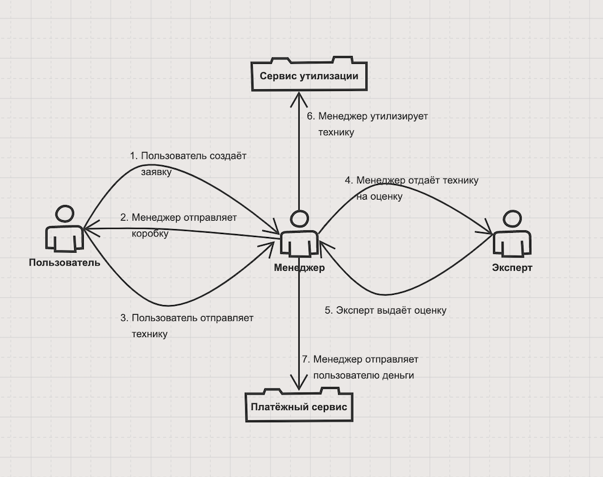

# Тактики работы с модифицируемостью

В рамках данного домашнего задания я продолжаю работать с катой [Going Green](https://nealford.com/katas/kata?id=GoingGreen) из [первого домашнего задания](https://github.com/iantropov/antropov-ivan-otus/blob/master/softwarearchitect/1-architectural-kata/going-green.md)

## Предметная область

Для выполнения данного задания, сократим бизнес процесс до следующей схемы:
1. Пользователь заводит заявку на выкуп техники
2. Менеджер отправляет пользователю коробку
3. Пользователь отправляет технику менеджеру
4. Менеджер отдаёт технику на оценку эксперту
5. Эксперт выдаёт заключение менеджеру
6. Менеджер утилизирует технику пользователя
7. Менеджер отправляет пользователю деньги за технику

Тогда исходя из такого видения бизнес процесса получим следующую модель предметной области:

Участвующие сущности:
  - пользователь
  - заявка пользователя на выкуп техники (со статусами)
  - менеджер
  - эксперт

## Варианты функциональной декомпозиции:

Предлагаю следующие варианты:

### Микросервисный подход

Этот подход из первой домашки. В нём представлены сервисы после разбиения как по сущностями (пользователи, категории техники), так и по процессам (сервис предварительной оценки):
 - Сервис пользователей
 - Сервис предварительной оценки
 - Сервис заявок пользователей
 - Сервис категорий техники
 - Сервис экспертных регламентов
 - Сервис аналитики
 - ВFF + фронт для КП
 - Админка

Дополнительно, я добавлю:
- Платёжный сервис - для интеграций с различными платёжными провайдерами
- Сервис утилизации - для интеграций с провайдерами по утилизации (eBay, перерабатывающие компании, ...)

### Макросервисный подход

В данном подходе будет более крупное разделение по контекстам бизнесс процесса (клиент - менеджер - эксперт):
 - Клиентская часть
   - Хранит пользователей и их связанные сущности (адреса, платёжная информация, история, ...)
   - Хранит отражение предметных сущностей для клиента (например, заявки в клиентской части содержат только ту информацию, которая будет показана клиенту)
 - Менеджерская часть
   - Хранит в себе всю логику сервиса
   - Позволяет взаимодействовать менеджерам и экспертам
   - Позволяет производить все процессы системы
 - Экспертная часть
   - Большое полнотекстовое хранилище инструкций/регламентов/протоколов для экспертов

## Тестирование предложенных декомпозиций

Тестировать свои варианты функциональной декомпозиции буду на следующих сценариях изменений:

1. Пользователям отображать отдельные статусы заявок
2. Пользователям добавить возможность Жаловаться
3. Добавить нового платёжного провайдера
4. Добавить новый новый сервис утилизации

Оцениваем стоимость изменений для первого варианта декомпозиции:

1. Доработать(Сервис Заявок Пользователей)
2. Новый(Сервис Жалоб) - При выбранном подходе логичным выглядит заведение нового сервиса для жалоб. В нём нужно будет реализовавывать механизм разделения информации для клиента и внутренней информации
3. Доработать(Платёжный сервис)
4. Доработать(Сервис утилизации)

Оцениваем стоимость изменений для второго вариант декомпозиции:
1. Доработать(Клиентская часть)
2. Доработать(Клиентская часть) (отображение обращений пользователей и ответов поддержки) + Доработать(Менеджерская часть) (отдельная внутренняя сущность со статусами и перепиской между менеджерами и экспертами. Часть сообщений публикуется пользователю)
3. Доработать(Менеджерская часть)
4. Доработать(Менеджерская часть)

## Выводы

В целом, номинально, оценка показывает, что данные варианты разбиения примерно равны - с небольшим перевесом в сторону варианта №2 в пункте №2, потому что доработать текущий сервис дешевле чем стартовать новый.

Но мне больше импонирует вариант №2 (макросервисный):
- Меньшая гранулярность модулей системы упрощает связи между ними. И цена добавления новой функциональности (как для Жалоб) не сильно усложняет картину решения. Регулярные добавления новых сервисов же несут с собой не только цену их разработки, но и цену дальнейших коммуникаций с ними и цену интеграций с ними же.
- Меньшая гранулярность уменьшает TTM (по крайней мере на первом этапе), а это одна из Критических характеристик
- Меньшая гранулярность, при соблюдении LCHC не мешает нам в будущем отпачковывать те модули, выделение которых будет оправдано. Получается lazy-service подход, когда мы откладываем полноценное выделение отдельных сервисов до того момента, когда это станет необходимым/оправданным.
