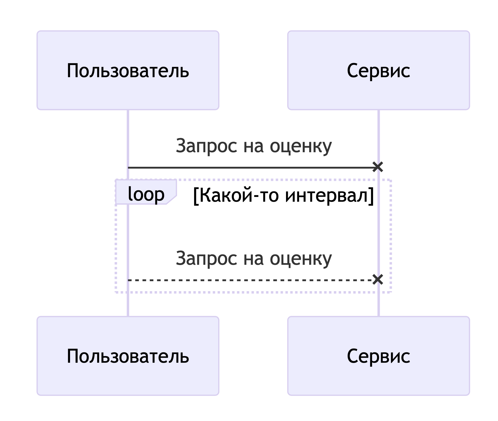

# Тактики работы с отказоустойчивостью

В рамках данного домашнего задания я продолжаю работать с катой [Going Green](https://nealford.com/katas/kata?id=GoingGreen) из [первого](https://github.com/iantropov/antropov-ivan-otus/blob/master/softwarearchitect/1-architectural-kata/going-green.md) и [второго](https://github.com/iantropov/antropov-ivan-otus/blob/master/softwarearchitect/2-functional-decomposition/functional-decomposition.md) домашних заданий.

## Исследуемые сценарии

В качестве предмета исследования я выбрал 2 сценария: запрос в сервис предварительной оценки и запрос на создание заявки на выкуп техники.

## Сценарий #1: Запрос в сервис предварительной оценки

**Участники:**

1. Пользователь через клиентское приложение
2. Сервис предварительной оценки

**Описание сценария:**

   1. Пользователь отправляет запрос на предварительную оценку своей техники
   2. Пользователь получает ответ о недоступности сервера
   3. Пользователь периодически повторяет запросы
   4. Сервис перезапускается/поднимается и ложится снова из-за накопленных запросов

**Диаграмма взаимодействия ДО:**

**Доработка сценария:**

В данной ситуации мы имеем проблему с регулированием нагрузки на Сервис предварительной оценки. Для устранения проблемы на шаге 4 мы можем применить паттерн Circuit Breaker (далее CB) на стороне клиента и тогда сценарий будет выглядеть следующим образом:
   1. Пользователь отправляет запрос на предварительную оценку своей техники
   2. Пользователь получает ответ о недоступности сервера
   3. Модуль CB переходит в состояние Разомкнут
   4. Пользователь периодически повторяет запросы
   5. CB отвечает о недоступности сервера без посылки реальных запросов
   6. CB в фоне проверяет доступность сервиса
   7. Сервис поднимается и получает постепенный набор объёма трафика

**Диаграмма взаимодействия ПОСЛЕ:**

**Примечания:**

Данное решение позволило регулировать объём трафика на нестабильный сервис и повысить надёжность/отказоустойчивость системы. Также это решение позволило улучить UX клиента, за счёт возможности получения быстрого ответа о состоянии сервиса и возможности отразить эту информацию пользователю.

Также доступны следующие варианты:
1. На шаге 6 CB может не посылать запросы в фоне, а достаточно редко пропускать запросы пользователя и наблюдать за статусом ответа.
2. Также можно вместо CB на стороне клиента решить проблему с нестабильным сервисом за счёт балансировки с обратной связью (пробами) на стороне сервиса, когда балансировщик знает статус сервисов под ним и может уводить трафик с нездоровых экземпляров.

## Сценарий #2: Запрос на создание заявки на выкуп техники

**Участники:**

1. Пользователь через клиентское приложение
2. Сервис заявок пользователей на выкуп техники

**Описание сценария:**

   1. Пользователь отправляет запрос на создание заявки на выкуп техники
   2. Сервис обрабатывает запрос и создаёт заявку
   3. Пользователь не получает ответ из-за временной сетевой ошибки
   4. Пользователь повторяет запрос на создание заявки
   5. Создаётся новая дублирующая заявка

**Диаграмма взаимодействия ДО:**

**Доработка сценария:**

В данной ситуации мы имеем проблему с дублированием создаваемых данных, поскольку пользователь на шаге 4 не имеет информации о том, что заявка из предыдущего запроса была создана успешно. Для решения данной проблемы можно применить обмен Idempotency ID (далее IID), с помощью которого сервис может связать две последовательные заявки от клиента. Сценарий будет выглядеть следующим образом:
   1. Пользователь получает IID requestId от сервиса
   2. Пользователь отправляет запрос на создание заявки на выкуп техники (вместе с requestId)
   3. Сервис обрабатывает запрос и создаёт заявку
   4. Пользователь не получает ответ из-за временной сетевой ошибки
   5. Пользователь повторяет запрос на создание заявки (с тем же requestId)
   6. Сервис видит, что данный requestId уже был использован при создании предыдущей заявки
   7. Сервис отвечает ошибкой о дублировании запроса с одинаковым requestId

**Диаграмма взаимодействия ПОСЛЕ:**

**Примечания:**

Данное решение позволило решить проблему дублирования данных и повысить отказоустойчивость системы. Но надо учитывать как и когда получать/обновлять requestId для пользователя. В приведённой схеме выше пользователь должен получать данный requestId перед созданием новой заявки, и его же он должен использовать при отправке/переотправке данных создаваемой заявки с теми же данными. Если пользователь решает создать отдельную новую заявку, что мы должны получить новый requestId.

Также можно было обойтись без введения отдельного механизма IID и использовать кортеж [ID пользователя, тип техники, некоторый уникальный атрибут техники] как уникальное значение. Это решение могло бы работать, если есть гарантии, что вся техника будет иметь некий серийный номер уникальный для данного вида техники. Но в общем случае это, скорее всего, не так и лучше не закладываться на это, а реализовать свой дополнительный механизм IID.
