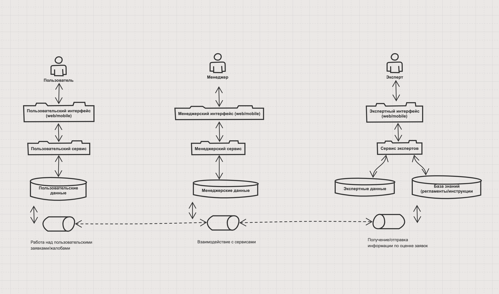
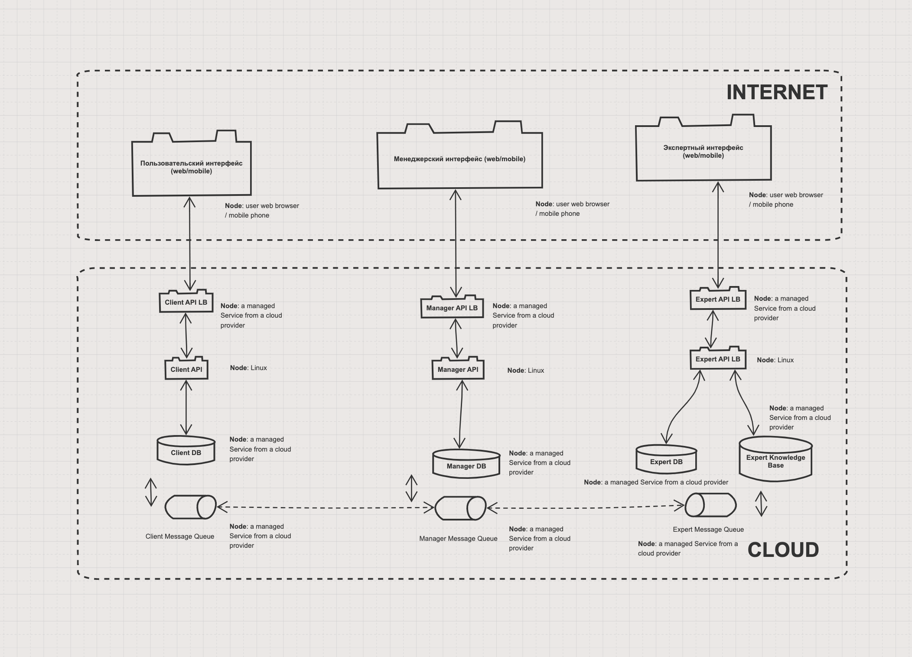

# Системное проектирование

В рамках данного домашнего задания я продолжаю работать с катой [Going Green](https://nealford.com/katas/kata?id=GoingGreen) из предыдущих домашних заданий

## Функциональная декомпозиция

При выполнении данного домашнего задания будем использовать следующую функциональную декомпозицию:
- Клиентская часть (КЧ)
  - Отвечает за взаимодействие с пользователем и предоставлением пользователю информации по его заявкам/обращениям
- Менеджерская часть (МЧ)
  - Отвечает за основную бизнес логику - работа по заявкам и предоставление информации КЧ и ЭЧ
- Экспертная часть (ЭЧ)
  - Предназначена для работы экспертов над заявками пользовалей с привлечением инструкций/регламентов/протоколов

## Диаграмма контейнеров приложения

## Декомпозиция слоя данных

Данные будут распределены следующим образом:

- Клиенская часть:
  - Информация о пользователе
  - Информация необходимая для работы с платёжными сервисами (типа Stripe)
  - Информация по пользовательской части заявок
  - Информация по пользовательской части обращений/жалоб
- Менеджерская часть:
  - Информация о заявках пользователей
  - Информация о жалобах пользователей
  - Информация для взаимодействия с почтовыми сервисами
  - Информация для взаимодействия с сервисами утилизации
  - Информация для взаимодействия с сервисами перепродажи (eBay, Avito)
- Экспертная часть:
  - Информация по экспертной части заявок
  - Инструкции/регламенты/протоколы

## Деплоймент диаграмма

## Примечания

Возможно в дальнейшем интенсификация/оптимизация сообщения между клиентскими и сервисным частями потребует выделения отдельных API для интерфейсов (BFF).  Что повлечёт за собой изменение диаграмм контейнеров и развёртывания (и, скорее всего, без особых изменений декомпозиции слоя данных).