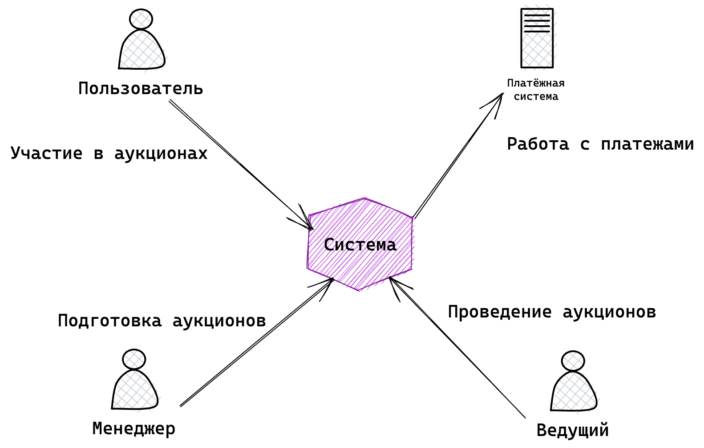
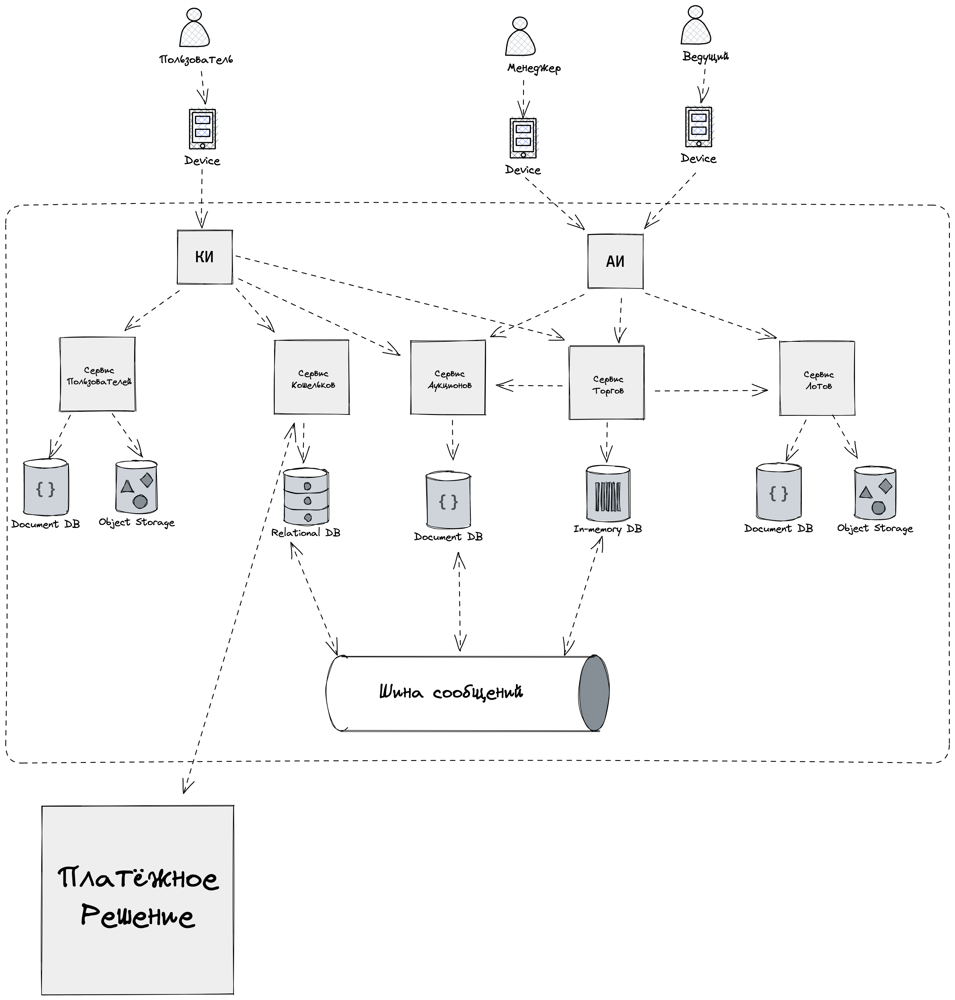

# Architectural Kata

## Описание

https://nealford.com/katas/kata?id=GoingGoingGone

**Going...Going...Gone!**

An auction company wants to take their auctions online to a nationwide scale--customers choose the auction to participate in, wait until the auction begins, then bid as if they were there in the room, with the auctioneer

**Users:**

User scale up to hundreds of participants (per auction), potentially up to thousands of participants, and as many simultaneous auctions as possible

**Requirements:**

- auctions must be categorized and 'discoverable'
- auctions must be as real-time as possible
- auctions must be mixed live and online
- video stream of the action after the fact
- handle money exchange
- participants must be tracked via a reputation index

**Additional Context:**

- auction company is expanding aggressively by merging with smaller competitors
- if nationwide auction is a success, replicate the model overseas
- budget is not constrained--this is a strategic direction
- company just exited a lawsuit where they settled a suit alleging fraud

## Решение

### Бизнес-цели и бизнес-драйверы

Создать масштабируемую систему, с которой можно будет выходить на уровень страны и мира.
Проводить аукционы как можно более в реал-тайме и зарабатывать на коммиссии как можно больше

### Стейкхолдеры и их потребности

- Менеджер аукциона (**менеджер**)
  - Возможность заведения лотов и аукционов
  - Информация и статистика по прошедшим аукционам
- Пользователь системы (**пользователь**)
  - Возможность поиска и участия в аукционах
  - Возможность пополнять кошелёк в разных валютах и оплачивать с него покупки лотов
- Ведущий аукциона (**ведущий**)
  - Возможность управлять процессов аукциона
  - Возможность взаимодействия с аудиторией (текстовые сообщения)

### Пользовательские истории

**Сводимые истории:**
- Видео с аукциона
- Проведение аукциона вживую

**Основные истории:**
- Менеджер заводит в системе лот аукциона
- Пользователь регистрируется
- Пользователь ищет нужный аукцион
- Пользователь пополняет кошелёк
- Ведущий запускает аукцион
- Пользователь подключается к аукциону
- Пользователь предлагает цену
- Ведущий закрывает аукцион с продажей
- Ведущий закрывает аукцион без продажи

### Атрибуты качества (и не функциональные требования)

- Система должна обеспечивать онлайн данными пользователей (бюджет обновления ~200ms в 95 перцентиле)
- Система должна обеспечивать поддерживать до 100_000 участников одновременных участников в каждом аукционе
- Система должна обеспецивать до 100 одновременных аукционов
- Увеличение числа поддерживаемых пользователей и аукционов решается только докупкой ресурсов

### Ограничения

- Финансовых нет
- Технологических нет
- Регуляторные - возможно повышенное внимание контролирующих органов после дела о мошенничестве

### Архитектурные альтернативы

- Проводить аукционы на eBay
- Писать свою систему

### Критические сценарии и критические характеристики

1. Менеджер загрузил в систему лот
2. Пользователь зарегистрировался
3. Пользователь пополнил кошелёк
4. Ведущий запустил аукцион
5. Пользователь подключился к аукциону
6. Пользователь сделал ставку
7. Ведущий закрыл аукцион с продажей
8. Ведущий закрыл аукцион без продажи

### Базовые сценарии

Далее **АИ** - это администраторский интерфейс
Далее **УЛ** - это сервис управления лотами
Далее **СТ** - это сервис торгов
Далее **СА** - это сервис аукционов
Далее **СК** - это сервис кошельков
Далее **КИ** - это клиентский интерфейс (web приложение)

**UC_1: Менеджер заводит в системе лот аукциона**
1. Менеджер вводит информацию о лоте (описание лота, сумма) в УЛ
2. Менеджер вводит информацию о предстоящем аукционе в СА (минимальный рейтинг, время старта)

**UC_2: Пользователь регистрируется в системе**
1. Пользователь заходит в КИ
2. Пользователь вводит информацию о себе, контактные данные, платёжные данные

**UC_3: Пользователь ищет нужный аукцион**
1. Пользователь заходит в КИ
2. Пользователь вводит информацию об интересующих лотах
3. КП обращается к СА
4. КП возвращает пользователю релевантные варианты аукционов

**UC_4: Пользователь пополняет кошелёк**
1. Пользователь заходит в КИ
2. Пользователь выбирает валюту пополнения (валюту кошелька назначения)
3. КП предлагает пользователю завершить платёж через 3DS на странице провайдера
4. Средства попадают в систему (уведомления получают заинтересованные сервисы)
5. Средства отображаются в КИ

**UC_5: Ведущий запускает аукцион**
1. Ведущий обращается к АИ
2. АИ инициирует запуск аукциона в СТ
3. СТ инициализирует новый аукцион
4. Новый аукцион становится доступным в АИ
5. Новый аукцион становится доступным в КИ

**UC_6: Пользователь подключается к аукциону**
1. Пользователь через КИ находит нужный аукцион
2. Пользователь проходит проверку репутации в СА
3. СА запускает пользователя в СТ
4. Пользователь в КИ видит интерфейс взаимодействия с аукционом

**UC_6: Пользователь предлагает цену**
1. Пользователь находится в КИ в интерфейсе аукциона
2. Пользователь предлагает новую цену (денег должно быть достаточно на счету пользователя)
3. Деньги блокируются на счету в СТ
4. СТ принимает новую цену сверки
5. Новая цена отображается у всех участников аукциона

**UC_7: Ведущий закрывает аукцион**
1. Ведущий инициирует закрытие аукциона в АИ
2. Всем участникам отображается завершение аукциона
3. СТ закрывает аукцион (если был победитель, то с него списывается сумма за лот в СК)
4. СТ выгражает информацию из памяти в хранилище на диске
5. СА забирает информацию о закрытом аукционе из СТ
6. Участники в КИ и АИ видят информацию о завершившимся аукционе

### Контекстная диаграмма

### ADR

- Система будет строиться из совокупности сервисов (микросервисов)

### Функциональная декомпозиция

- Администраторский интерфейс
- Клиентский интерфейс
- Сервис управления лотами
- Сервис пользователей
- Сервис кошельков
- Сервис торгов (онлайн аукцион)
- Сервис аукционов (оффлайн данные об аукционе+история)

### Диаграмма контейнеров

### ADR (сервис торгов)

Это самый высоконагруженный модуль системы.
Задачи сервиса:
- Инициализировать состояние аукциона при запуске
- Поддерживать своё состояние in-memory
- Поддерживать web-socket соединения со всеми участниками аукциона
- Рассылать изменения в аукционе всем участникам
- Принимать входящих пользователей
- Принимать уведомления от сервиса кошельков о пополнении счёта пользователя
- Поддерживать состояние каждого участника аукциона
- При завершении уведомлять систему о закрытии аукциона
- Выгружать данные из памяти на диск при завершении аукциона
- Удалять данные после подтверждения от Холодного сервиса об приёме истории

Горячие места сервиса:
- Количество одновременных подключений
- Бюджет на рассылку уведомлений

Для терминирования WS подключений - Lightstreamer
Для in-memory базы - Tarantool

Архтектурно состоит из:
- Кластер Tarantool
- Кластер нод для терминирования WS соединений
- Шина сообщений для уведомлений между нодами

Архитектурно работает:
- Пользователи шардируются по нодам по userId
- Данные реплицируются внутри кластера Tarantool
- При получении сообщения от участника (текстовое сообщение или новая цена) публикуются на шину
- Все ноды при новых сообщениях на шине рассылают данные всем участников релевантных аукционов

Чтобы скалировать систему горизонтально:
1. Команда увеличивает кластер in-memory db в СА
2. Команда увеличивает кластер терминирующих нод в СА

Количество данных:
Аукционы - каждую секунду сообщение/цена - 3600 * 10 КБ = 36 МБ * 100 = 5 ГБ
Пользователи - количество денег на счёте - 100_000 * 1 КБ = 1 ГБ

Дополнительно шардирование данных по аукционам/пользователям на кластере Тарантула

Consistency Hashing при шардировани пользователей

https://stackoverflow.com/questions/17448061/how-many-system-resources-will-be-held-for-keeping-1-000-000-websocket-open

### ADR (сервис кошельков)

Надежное реляционное хранилище с транзакциями.
Функционал:
- создание кошелька пользователя в какой-то валюте
- удаление кошелька пользователя в валюте
- пополнение кошелька в выбранной валюте
- вывод денег с кошелька в выбранной валюте
- переводы валют между кошельками

Взаимодействует с банком/платёжным сервисом для приёма и вывода платежей.

Пользователей 10_000_000, у каждого до 10 кошельков - 10^8, по каждому - 10ки килобайт (данные + история). Данных 10ки-100ни ГБ

### ADR (сервис аукционов)

Информация о будущих или прошедших аукционах. Достаточно какого-нибудь документо-ориентированного хранилища. Информации 10-ки-100-ни ГБ

### ADR (сервис лотов)

Информация о лотах. Текст + изображения. Достаточно какого-нибудь документо-ориентированного хранилища + S3 для картинок. Информации 10-ки-100-ни ГБ

### ADR (сервис пользователей)

Хранение информации о пользователях. Достаточно какого-нибудь документо-ориентированного хранилища + S3 для картинок. Информации 10-ки-100-ни ГБ

### ADR (Клиентский интерфейс)

Обычная история BFF + client-side. NextJS + NestJS + React. Задачи агрегации, проксирования.

### ADR (Администраторский интерфейс)

Обычная история BFF + client-side. NextJS + NestJS + React. Своих данных нет. Задачи агрегации, проксирования.

### Диаграмма развёртывания

**Примечания:**
- Разворачиваемся в облаке (с некоторой системой оркестрации, скорее всего K8S)
- Все хранилища (Document, Relational, Object, In-Memory) - managed serviceы
- Все балансеры - MS
- Все MB - MS
- Разворачиваемся в 3х зонах доступности
  - СТ - 4i * 3dc (64GB, 8 cores, 1GBs)
  - СЛ - 1i * 3dc (8GB, 4 cores, 1GBs)
  - СА - 1i * 3dc (8GB, 4 cores, 1GBs)
  - СП - 1i * 3dc (8GB, 4 cores, 1GBs)
  - СК - 1i * 3dc (8GB, 4 cores, 1GBs)
  - АИ - 1i * 3dc (8GB, 4 cores, 1GBs)
  - КИ - 1i * 3dc (8GB, 4 cores, 1GBs)
